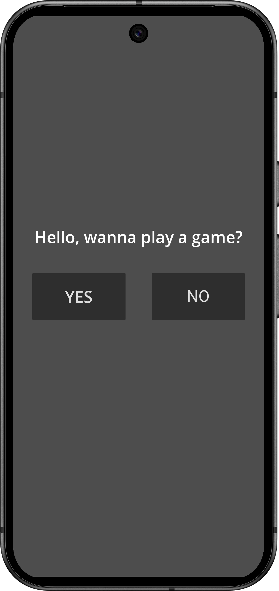
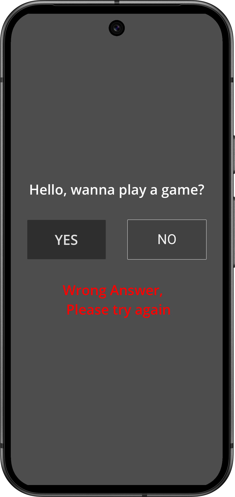
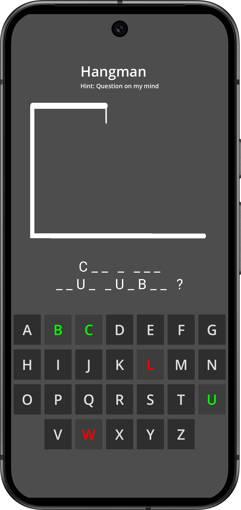
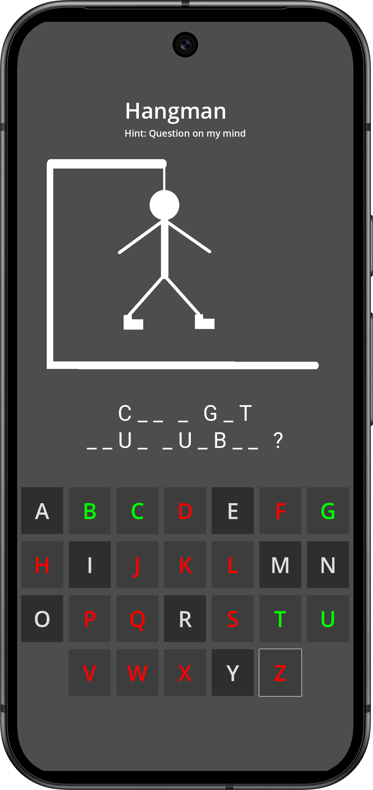
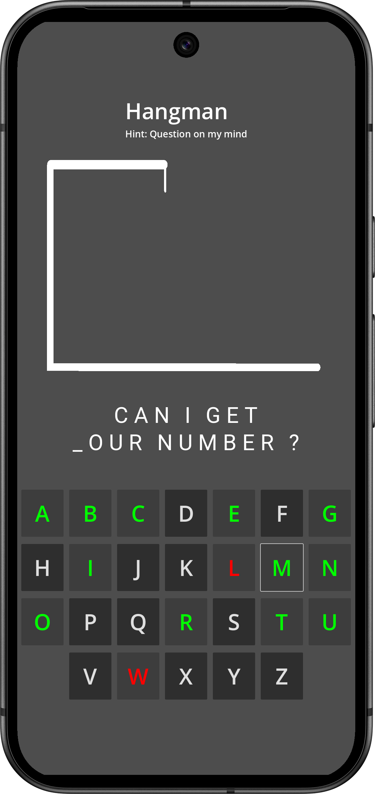
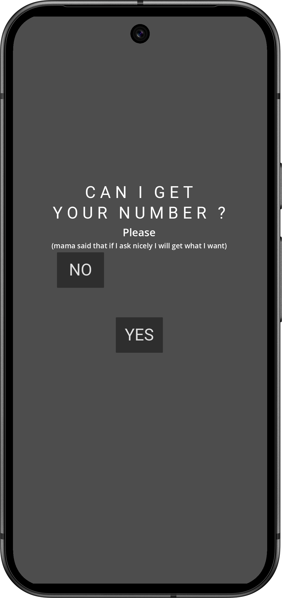
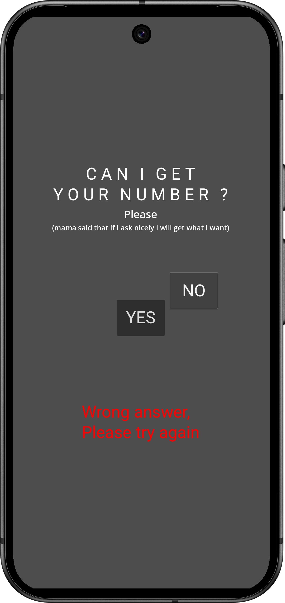

# women-number-generator

### IMPORTANT NOTE: This is just a joke.It is just a simple app to be used for humoristic purposes. Please treat people with respect and do not annoy them.

## About
Ever found yourself at a party, locked in a mental battle over the perfect way to ask for a girl’s number? Struggling to come up with a clever pickup line, only to fumble through an awkward conversation? Or even worse, having to explain your pickup line. Worry no more! The Women Number Generator App is here to "help"—because why stress over getting her number when you can just get it?

## How does it work?
1. Locate you target , open the app, and give them your phone (Note: do so at your own risk as some users reported their phones being stolen)

2. Now she is faced with a screen asking her if she wants to play a game. (Disclaimer: It was leaked that allegedly, during the development of this app, some women thought that a serial k*ll3r was after them during a focus group research but the creators neither confirmed nor denied said allegations )

  

3. Some people might say that she has the option to say no. But like life, choice is just ans illusion and if she tries to select no, the gets that it's the wrong answer. And logically, she has no other option than to say yes.

  

4. She is now inside the game. We should also point out that this game is definitely a new concept and not inspired in any way, shape or form by hangman.

  

5. Now rest assured in case someone is a little bit tipsy, there's no mechanism in the game to lose.

  

6. And of course the question is "Can I get your number ?"

  

7. Now that she guessed the question, She has to answer it

  

8. And as discussed before, choice is an illusion, but the catch this time is that when the "NO" button is pressed, it jumps to a random place on the screen. SOme users reported the yes and no buttons getting swapped on keypress but this definitely a bug and not a feature that we were'nt able to replicate. (Note: this is a good time to embrace yourself as at this stage, there's a non 0 chance that you will either get slapped, kicked or you will face the infamous `drink toss` also known as the `cocktail slap`)

  

9. Et voilà, she now have to press yes and enter her number

  

## Here's a video of the app flow

## How to run?
Just don't

## TODO:

- [ ] Transform this idea into a unicorn
- [ ] Add CI/CD to build APKs for github releases
- [ ] Add Video Recording
- [ ] Upgrade to new godot and add missing files in repo
- [ ] Update Docs and how to run
- [ ] Cleanup code
